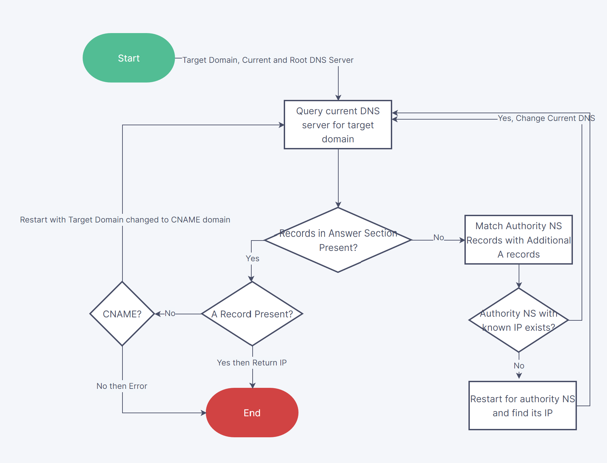

# DNSWhy

This repository contains work in progress code for a python DNS query tool. There are no reasons for its existence apart from understanding DNS protocol.

Directory Structure -
 - `manual` - contains scripts I used early on in this project to manually send and interpret DNS messages.
 - `.` - Root directory has the final version files.

## Logic

The recurisve logic is mostly summarized by the below diagram.
